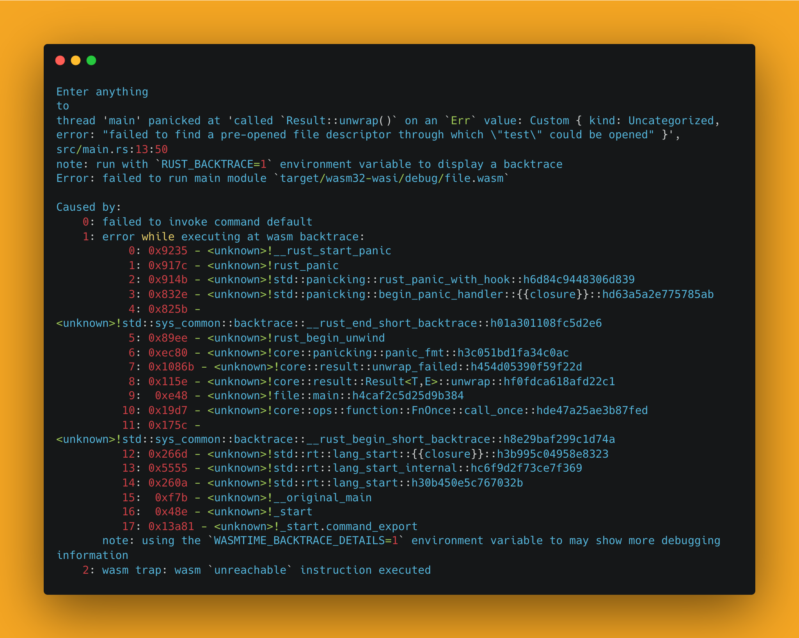

# Notes

## Wasmtime
The program panics if we do not run the executable with the appropriate [capabilities](https://en.wikipedia.org/wiki/Capability-based_security).



We can 'fix' this by running the executable with the appropriate capabilities.

`wasmtime --mapdir ./::. target/wasm32-wasi/debug/file.wasm`


The syntax is:

```wasmtime --mapdir GUEST_DIRECTORY::HOST_DIRECTORY my-wasi-program.wasm```

It gives explicit access to create files to a given directory, the docs say: `Grant access to a guest directory mapped as a host directory` <br />
Where:
- `GUEST_DIRECTORY` is the directory that will be created in the guest environment (the wasm runtime environment)
- `HOST_DIRECTORY` is the directory that must be present on the host. The guest will have access to this directory.

In summary the program will have access to the `HOST_DIRECTORY` via the specified `GUEST_DIRECTORY`

### References

https://wasmbyexample.dev/examples/wasi-hello-world/wasi-hello-world.rust.en-us.html

## Wasmer

With wasmer everything runs smoothly, no need to specify capabilities, in fact

`wasmer run target/wasm32-wasi/debug/file.wasm`

