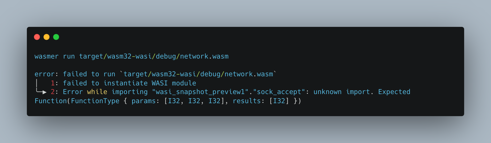
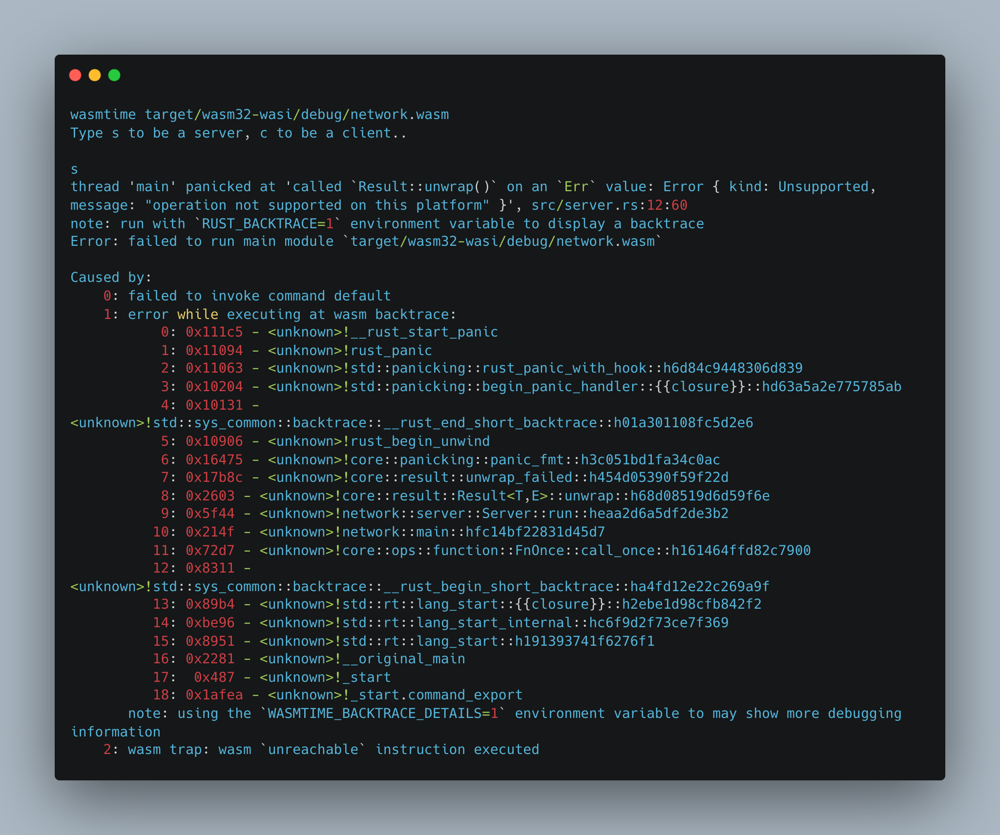

# Notes

The program won't work with wasi, both wasmer and wasmtime will fail:

## wasmer

## wasmtime

this is because neither of them yet support the networking API.

see [here](https://profian.com/wasi-networking/) for more infos.

the article says to use the Enarx project, which example is [here](https://enarx.dev/docs/networking)

will try.