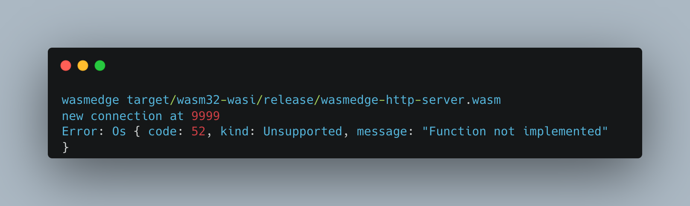

# Notes

Following [these wasmedge instructions](https://wasmedge.org/book/en/write_wasm/rust/networking.html).

## Important 
macos won't work, error:



[here to read more](https://qiita.com/watawuwu/items/91052a93484d19d4fb1f)

the important bit:

```
以下のように実行したいところですが、v0.11.2 では macOS の実装がされておらず、リクエストすると次のようなメッセージが出力されてしまいます。
```

```
You would like to execute the following, but the macOS implementation is not available in v0.11.2 and the following message is output when you request it.
```